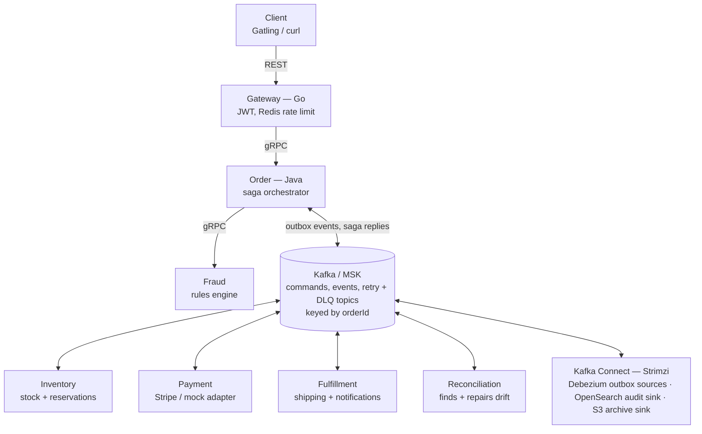
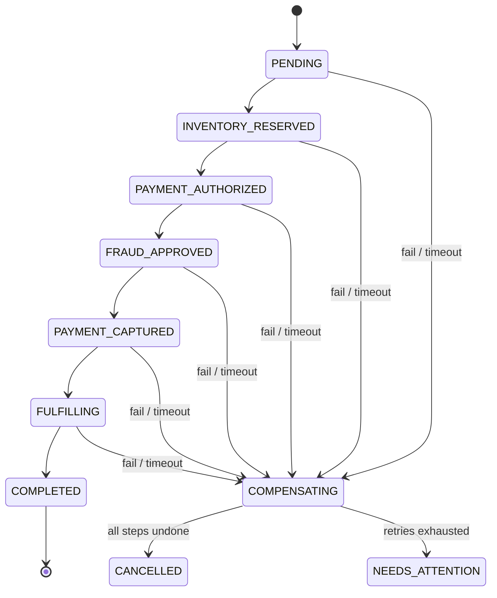

# Nexus — Project Spec

> Event-driven, distributed order-processing backend for a simulated e-commerce platform.
> Status: planned (build later). Open decisions are listed at the end.

---

## 1. Overview

Nexus is the backend that runs after a customer clicks **Place order**. Seven microservices coordinate each order through an **orchestrated saga** over Kafka until the order is either fully **COMPLETED** or fully **CANCELLED**, and the system stays correct when services crash, messages are duplicated, or traffic spikes.

**Purpose:** a portfolio project that demonstrates distributed-systems engineering with **reproducible benchmark numbers**, not estimates.

**Skills it demonstrates:** Java 21 + Spring Boot, Go, Kafka, gRPC, Debezium (CDC), PostgreSQL, Redis, OpenSearch, Kubernetes + Helm + KEDA, Terraform, AWS (EKS, MSK, RDS, ElastiCache, S3, ECR, IAM, Secrets Manager), OpenTelemetry / Prometheus / Grafana, Testcontainers, Gatling, Chaos Mesh, Stripe (test mode), GitHub Actions.

**Non-goals:** real money movement, ML-based fraud detection, a customer-facing storefront UI. The only UI is Grafana plus a small admin API (DLQ replay, reconciliation findings, order timeline).

### How it is shown

1. **Demo video (2–3 min):** run load, kill the Payment service live, show orders recovering in Grafana with nothing lost.
2. **README:** architecture diagram, benchmark results table, one-command local setup (`make up`).
3. **Optional:** read-only admin page to look up an order and see its full event timeline.

---

## 2. Tech stack

| Layer | Choice | Role in Nexus |
|---|---|---|
| Services | Java 21 LTS, Spring Boot 3.x, Spring Kafka, Resilience4j | Order, Inventory, Payment, Fraud, Fulfillment, Reconciliation |
| Gateway | Go (net/http or chi), go-redis, grpc-go | Edge routing, JWT validation, rate limiting |
| Auth | Keycloak (OIDC, JWT) | Token issuer; gateway validates tokens |
| Messaging | Apache Kafka (KRaft); AWS MSK in cloud | Saga commands and events, retries, DLQs |
| CDC | Debezium on Kafka Connect (Strimzi on EKS) | Transactional outbox relay |
| Sync calls | gRPC + Protobuf | Gateway → Order, Order → Fraud |
| Database | PostgreSQL 16 (AWS RDS in cloud), Flyway | One database per service |
| Cache | Redis (AWS ElastiCache in cloud) | Rate-limit buckets, stock-availability read cache |
| Search | OpenSearch (via Kafka Connect sink) | Immutable audit log and operational search |
| Payments | Stripe test mode + mock adapter | Real auth/capture/refund semantics; mock for load tests |
| Observability | OpenTelemetry, Prometheus, Grafana, Tempo | Traces across Kafka hops, metrics, dashboards |
| Infra | Docker, Kubernetes, Helm, KEDA, Terraform | Deploy, autoscale on consumer lag, provision AWS |
| CI/CD | GitHub Actions (OIDC to AWS) | Test, build, push to ECR, deploy |
| Testing | JUnit 5, Testcontainers, Go testing | Unit + integration against real Kafka/Postgres |
| Load + chaos | Gatling, Chaos Mesh | Throughput, latency, failure-recovery benchmarks |

**Deliberately cut:** Python/FastAPI (no new skill), ClickHouse (duplicates OpenSearch), Redpanda (Kafka is the searched keyword), separate Audit service (Kafka Connect sink does it), separate Notification service (merged into Fulfillment).

---

## 3. Architecture



Each service owns its own Postgres database and outbox table. No service reads another service's tables. Order is the only service that knows the whole flow.

| Service | Lang | Owns | Talks via | Key responsibility |
|---|---|---|---|---|
| Gateway | Go | Redis buckets | REST in, gRPC out | JWT check, per-client token-bucket rate limit, Idempotency-Key passthrough |
| Order | Java | orders, saga_instances, outbox | gRPC in; Kafka out/in; gRPC to Fraud | Creates orders, runs the saga state machine, deadlines, compensations |
| Inventory | Java | stock, reservations, outbox | Kafka | Reserve/release stock via conditional update; reservation TTL; Redis read cache |
| Payment | Java | payments, outbox | Kafka | Authorize, capture, void, refund; idempotency per order + operation; Stripe or mock |
| Fraud | Java | rules, decisions | gRPC | Rules engine (velocity, amount, blocklist) → APPROVE / REJECT in ms |
| Fulfillment | Java | shipments, notifications, outbox | Kafka | Shipment lifecycle; idempotent order/payment/shipping notifications |
| Reconciliation | Java | order_projection, findings | Kafka in, Kafka commands out | Per-order view from all events; flags mismatches; issues repair commands |

---

## 4. Order saga

The Order service orchestrates: it sends one command at a time, waits for the reply event, and on any failure or timeout runs compensations for completed steps **in reverse order**. Saga state is persisted in `saga_instances`, so a crashed Order pod resumes where it left off.



| Step | Command (channel) | Success | Failure / timeout | Compensation |
|---|---|---|---|---|
| 1 Reserve stock | ReserveInventory (Kafka) | InventoryReserved | InventoryRejected (out of stock) | none → CANCELLED |
| 2 Authorize payment | AuthorizePayment (Kafka) | PaymentAuthorized | PaymentDeclined | ReleaseInventory |
| 3 Fraud check | Evaluate (gRPC, circuit breaker) | APPROVE | REJECT, or breaker open past deadline | VoidPayment, ReleaseInventory |
| 4 Capture payment | CapturePayment (Kafka) | PaymentCaptured | CaptureFailed | VoidPayment, ReleaseInventory |
| 5 Fulfill | CreateShipment (Kafka) | ShipmentCreated | FulfillmentFailed | RefundPayment, ReleaseInventory |
| 6 Complete | — | OrderCompleted event | — | — |

- Every step has a deadline (default 30 s). A scheduler scans `saga_instances` for overdue steps, retries the command once, then compensates.
- Compensations are idempotent commands with retries; releasing or refunding twice is a no-op.
- Notifications are not saga steps: Fulfillment consumes `order.events` and sends confirmation, cancellation and shipping messages asynchronously.
- `NEEDS_ATTENTION` is reached only when a compensation itself fails after all retries; Reconciliation picks these up.

---

## 5. Kafka topics and events

Every message is keyed by `orderId`, so all events for one order land on one partition and are processed in order.

| Topic | Producer | Consumer groups | Partitions |
|---|---|---|---|
| inventory.commands | Order (outbox) | inventory-svc | 12 |
| payment.commands | Order (outbox) | payment-svc | 12 |
| fulfillment.commands | Order (outbox) | fulfillment-svc | 12 |
| inventory.events | Inventory (outbox) | order-saga, reconciliation | 12 |
| payment.events | Payment (outbox) | order-saga, reconciliation | 12 |
| fulfillment.events | Fulfillment (outbox) | order-saga, reconciliation | 12 |
| order.events | Order (outbox) | fulfillment-notify, reconciliation, audit-sink | 12 |
| `<topic>.retry-1s / 5s / 30s` | Spring Kafka retry | same group as source | 12 |
| `<topic>.dlq` | Spring Kafka retry | admin API (replay) | 3 |

- 12 partitions to start; benchmarks sweep 6 / 12 / 24 to show scaling with consumers.
- Producers: `acks=all`, idempotence on. Consumers commit offsets only after the DB transaction commits.
- Schemas: versioned JSON Schema in `contracts/` (Avro + schema registry is a stretch goal).

**Event envelope:**

```json
{
  "eventId": "uuid",
  "eventType": "PaymentAuthorized",
  "schemaVersion": 1,
  "orderId": "uuid",
  "sagaId": "uuid",
  "occurredAt": "2026-10-02T18:00:00Z",
  "payload": {}
}
```

The W3C `traceparent` travels as a Kafka header, so one trace spans gateway → every service → every Kafka hop.

---

## 6. Data model, outbox and idempotency

Each service writes its state change **and** its outgoing event in the same Postgres transaction (outbox). Debezium reads the outbox from the WAL and publishes to Kafka. No service ever writes to the database and Kafka separately.

| Service | Core tables | Constraint that protects correctness |
|---|---|---|
| Order | orders, order_items, saga_instances, outbox, idempotency_keys | `idempotency_keys.key` unique: a retried POST returns the original order |
| Inventory | stock (sku, available, reserved, version), reservations, outbox | Conditional update `available = available - :qty WHERE sku = :sku AND available >= :qty`; 0 rows = rejected, never negative |
| Payment | payments, payment_attempts, outbox | Unique `(order_id, operation)`: one authorize / capture / refund per order |
| Fulfillment | shipments, notifications, outbox | Unique `(order_id)` on shipments; unique `(order_id, type)` on notifications |
| Reconciliation | order_projection, findings, repairs | Unique `(order_id, finding_type)` so a mismatch is reported once |
| All consumers | processed_events (consumer_group, event_id) | Primary key, inserted in the same transaction as the side effect → duplicates skipped |

**Outbox table (every service):** `id uuid, aggregate_type, aggregate_id, event_type, payload jsonb, created_at`. Debezium's Outbox Event Router routes rows to `<aggregate_type>.events` / `.commands`, keyed by `aggregate_id`. Rows older than 24 h are deleted by a cron job.

**Redis read cache:** stock availability for product reads (cache-aside, 5 s TTL, evicted on every reservation). Writes always go to Postgres, so the cache can never cause overselling.

**Money:** `long` cents + ISO currency code. Never floating point.

---

## 7. Reliability patterns

Delivery is **at-least-once** everywhere; correctness comes from idempotent consumers, not Kafka exactly-once.

| Pattern | Implementation | What it proves |
|---|---|---|
| Retries with backoff | Spring Kafka non-blocking retry topics: 1 s, 5 s, 30 s; transient errors only | A slow dependency doesn't block the partition |
| Dead-letter queue | After last retry → `<topic>.dlq` with error headers; permanent errors go straight there | Poison messages isolated, not lost |
| DLQ replay | Admin API: list, replay one or all after a fix | Recovery is an operation, not manual SQL |
| Event replay | Reset consumer-group offsets to rebuild read models; S3 sink archives events beyond retention | Read models are rebuildable |
| Circuit breaker | Resilience4j on Fraud gRPC and Stripe adapter | One failing dependency doesn't exhaust threads |
| Rate limiting | Redis token bucket (atomic Lua) per API key at gateway; 429 + Retry-After | Overload shed at the edge |
| Reservation TTL | Reservations expire after 10 min; sweeper releases holds | Abandoned sagas can't lock stock forever |

**Reconciliation (every 60 s)** builds a per-order projection from all `*.events` topics and checks:

1. Order COMPLETED → payment CAPTURED and shipment exists. Repair: re-issue missing command.
2. Order CANCELLED → no CAPTURED payment without a REFUND. Repair: RefundPayment.
3. Reservation HELD → its order is still in progress. Repair: ReleaseInventory.
4. Saga non-terminal past 2× its deadline. Repair: resume or compensate.
5. Sum of reserved stock per SKU = sum of HELD reservations. Flag only.

Each finding stores its detection time, so detection rate and time-to-detect are measured directly.

---

## 8. AWS and infrastructure

Develop locally on Docker Compose and kind. Bring up AWS **only for benchmark sessions**, then `terraform destroy`. Everything in AWS is created by Terraform.

| AWS service | Used for | Terraform module |
|---|---|---|
| VPC | Private subnets for data stores, public for the load balancer | `vpc` |
| EKS | All services, Kafka Connect (Strimzi), Keycloak, observability stack | `eks` |
| MSK | Kafka brokers (final benchmark runs; Strimzi on EKS during iteration) | `msk` |
| RDS PostgreSQL | One instance, one database per service | `rds` |
| ElastiCache Redis | Rate limits, stock cache | `redis` |
| OpenSearch Service | Audit index | `opensearch` |
| ECR | Container images | `ecr` |
| S3 | Event archive, benchmark results, Terraform state | `s3` |
| IAM (IRSA) + Secrets Manager | Per-service roles; DB and Stripe credentials | `iam` |
| AWS Budgets | Cost alert before any spend surprise | `budget` |

**Kubernetes:** one Helm chart per service + umbrella chart. KEDA scales Java consumers on Kafka consumer lag; HPA scales the gateway on CPU. Readiness probes check Kafka and Postgres; PodDisruptionBudgets keep ≥1 replica during chaos tests.

**CI/CD (GitHub Actions):**

1. PR: build, unit tests, Testcontainers integration tests, lint.
2. Merge to main: build images, push to ECR via OIDC, Helm deploy to dev cluster.
3. Manual `bench` workflow: deploy tagged version, run Gatling + chaos scenarios, upload results JSON to S3.
4. Terraform: `plan` on PR, `apply` only by manual approval.

**Cost control:** Budgets alert before first apply; cloud only during benchmark sessions; destroy after each session. Approximate full-stack cost is on the order of $1–1.50/hour while running (estimate — verify with the AWS Pricing Calculator).

---

## 9. Observability

One order = one trace, from the gateway REST call through every Kafka hop to `OrderCompleted`. OTel Java agent instruments Spring services; Go gateway uses the OTel SDK; Collector → Tempo (traces) + Prometheus (metrics) → Grafana.

**Custom metrics:**

- `saga_completed_total`, `saga_compensated_total{reason}`, `saga_needs_attention_total`
- `saga_duration_seconds` histogram (source of end-to-end p50/p95/p99)
- `duplicate_events_skipped_total{consumer_group}`
- `dlq_messages_total{topic}`, `reconciliation_findings_total{type}`
- `stock_cache_hits_total`, `stock_cache_misses_total`
- Kafka consumer lag per group (kafka-exporter)

**Dashboards:** Saga funnel · Latency (gateway + saga p50/p95/p99) · Kafka (throughput, lag, DLQ depth) · Reconciliation (findings, time to detect) · Infra (pods, CPU, KEDA replicas).

**Alerts:** lag over threshold for 2 min, DLQ depth > 0, any NEEDS_ATTENTION saga, p99 above target for 5 min.

---

## 10. Benchmarks and chaos tests

Every resume number comes from one of six scripted scenarios, run 3× on a recorded environment, median reported. Results JSON (commit SHA, instance types, node count, partitions, replicas) goes to `bench/results/` and S3, and into a README table.

| Scenario | How it runs | Metrics produced |
|---|---|---|
| S1 Steady-state ramp | Gatling ramps order rate until saga p99 breaks target; payment uses mock adapter | Max orders/sec, Kafka events/sec, p50/p95/p99 (gateway + end-to-end) |
| S2 Traffic spike | Steady rate → 10× for 2 min → back; KEDA on vs off | Peak lag, backlog recovery time, replica count over time |
| S3 Duplicate storm | Chaos producer re-sends N% of events; Gatling retries POSTs with same Idempotency-Key | Duplicates received vs duplicate side effects (target 0) |
| S4 Infra faults | Chaos Mesh: kill Payment pods, kill a Connect worker, 500 ms Postgres delay, broker restart | Recovery time, orders lost (target 0), stuck sagas |
| S5 Business failures | Seeded X% out-of-stock, Y% declines, Z% fraud rejects | Compensation success rate, time to compensate, stock drift (target 0) |
| S6 Reconciliation | Script injects N known inconsistencies into service DBs | Detection rate, time to detect, auto-repair rate |

**Cache comparison (inside S1):** Redis stock cache on vs off → hit ratio and Postgres read QPS reduction.

**Metric definitions:**

- *Orders/sec* = orders reaching COMPLETED per second (not POSTs accepted).
- *End-to-end latency* = `saga_duration_seconds` (POST accepted → COMPLETED). Gateway latency reported separately.
- *Recovery time* = fault injected → error rate and lag back to baseline.
- *Compensation success* = clean CANCELLED / sagas that entered COMPENSATING.

---

## 11. Repo structure

```text
nexus/
  contracts/            # Protobuf (gRPC) + JSON Schemas for events
  libs/
    messaging/          # outbox writer, idempotent-consumer base, retry config
    observability/      # shared metrics + tracing setup
  services/
    gateway/            # Go
    order/  inventory/  payment/  fraud/  fulfillment/  reconciliation/
  deploy/
    compose/            # local: Kafka, Postgres, Redis, Debezium, Keycloak, OpenSearch, Grafana
    helm/               # chart per service + umbrella chart
    connect/            # Debezium + OpenSearch + S3 connector configs
  infra/terraform/      # vpc, eks, msk, rds, redis, opensearch, ecr, s3, iam, budget
  bench/
    gatling/            # S1–S3 simulations
    chaos/              # Chaos Mesh YAML for S4
    scenarios/          # S5 seed data, S6 inconsistency injector
    results/            # committed JSON + generated README table
  docs/
    adr/                # architecture decision records
  SPEC.md               # this file
  CLAUDE.md
  Makefile              # make up, make test, make bench SCENARIO=s1
```

**ADRs to write:** orchestration vs choreography · outbox vs dual write · at-least-once + idempotency vs Kafka transactions · gRPC for Fraud.

---

## 12. Build plan (~7–8 weeks)

Each phase ends with something demoable. Phase 1 alone is resume-worthy.

### Phase 1 — Core saga, local (weeks 1–2)
- [ ] Monorepo, Gradle, Docker Compose with Kafka, Postgres, Debezium, Redis
- [ ] Order, Inventory, Payment services with outbox tables and Debezium connectors
- [ ] Saga state machine for steps 1, 2, 4 with compensations and deadlines
- [ ] Idempotent consumer base (`processed_events`) and API Idempotency-Key
- [ ] Testcontainers tests: happy path, out-of-stock, card decline, duplicate event
- **Done when:** 1,000 scripted orders with mixed failures end with 0 stock drift and 0 double charges

### Phase 2 — Full flow + failure handling (weeks 3–4)
- [ ] Fraud service over gRPC with Resilience4j circuit breaker
- [ ] Fulfillment + notifications; step 5 and refund compensation
- [ ] Retry topics, DLQs, admin DLQ replay endpoint
- [ ] Stripe test-mode adapter alongside the mock
- **Done when:** killing any one service mid-load loses no orders once it restarts

### Phase 3 — Edge, audit, reconciliation (week 5)
- [ ] Go gateway: routing, JWT via Keycloak, Redis token bucket, gRPC to Order
- [ ] OpenSearch sink and S3 archive connectors
- [ ] Reconciliation service with the 5 invariants and repair commands
- **Done when:** all S6-injected inconsistencies are detected locally

### Phase 4 — Observability + benchmarks (week 6)
- [ ] OpenTelemetry tracing across Kafka hops, custom metrics, 5 Grafana dashboards
- [ ] Gatling S1–S3, Chaos Mesh S4, seed scripts S5–S6, results JSON writer
- **Done when:** `make bench SCENARIO=s1` runs end to end on kind and writes results

### Phase 5 — AWS + CI/CD (weeks 7–8)
- [ ] Terraform modules, remote state in S3, budget alert
- [ ] Helm charts, KEDA on consumer lag, HPA on gateway
- [ ] GitHub Actions: PR tests, ECR push via OIDC, Helm deploy, manual bench workflow
- [ ] Run all six scenarios 3× on EKS; publish README results table; `terraform destroy`
- **Done when:** every resume number links to a committed results file

---

## 13. Resume bullets (X-Y-Z format)

Target numbers — replace with measured results from `bench/results/` before use.

```latex
\begin{itemize}
  \item Built an event-driven order platform of 7 microservices processing 1,000+ orders/sec at under 500 ms p99 latency, by orchestrating sagas over Kafka with a Debezium transactional outbox, using Java/Spring Boot, Go and gRPC on AWS EKS
  \item Achieved 99.9\% saga compensation success across 10,000 injected failures and zero duplicate charges across 50,000 replayed events, by building idempotent consumers, retry topics, dead-letter queues and a reconciliation service
  \item Cut Kafka backlog recovery from 12 to 3 minutes under 10x traffic spikes by autoscaling consumers on lag with KEDA, provisioning EKS, MSK and RDS with Terraform and Helm, and tracing every order end to end with OpenTelemetry
\end{itemize}
```

### Interview questions this project should answer

1. Why an outbox instead of writing to the DB and Kafka in one method? (dual-write failure)
2. Why orchestration over choreography? (one place to see and debug saga state)
3. Why at-least-once + idempotency instead of exactly-once? (exactly-once stops at Kafka's edge; Postgres and Stripe side effects still need idempotency)
4. Why key by orderId, and what happens to ordering when partitions are added?
5. How do you prevent overselling without a distributed lock?
6. What happens if the Order pod dies between steps 3 and 4?
7. What did reconciliation catch that the saga could not?

---

## 14. Open decisions

| Decision | Options | Current default |
|---|---|---|
| Fraud check order | (a) authorize payment → fraud check (current flow) · (b) fraud check first, so rejected orders never place a card hold | (a), confirmed 2026-10-07 |
| Project name | Nexus, or alternatives (Ledgerline, OrderFlow, Conductor…) | Nexus |
| Event schema format | JSON Schema · Avro + schema registry | JSON Schema; Avro as stretch |
